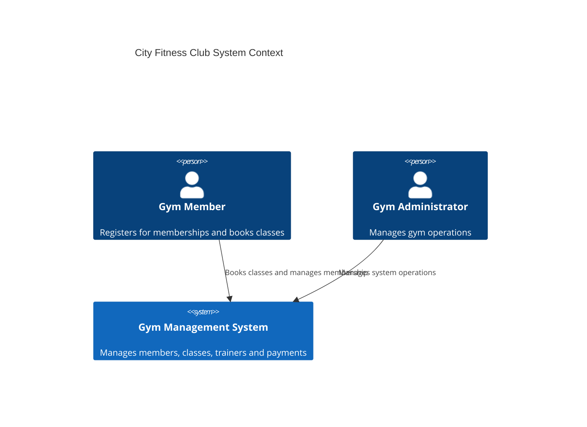
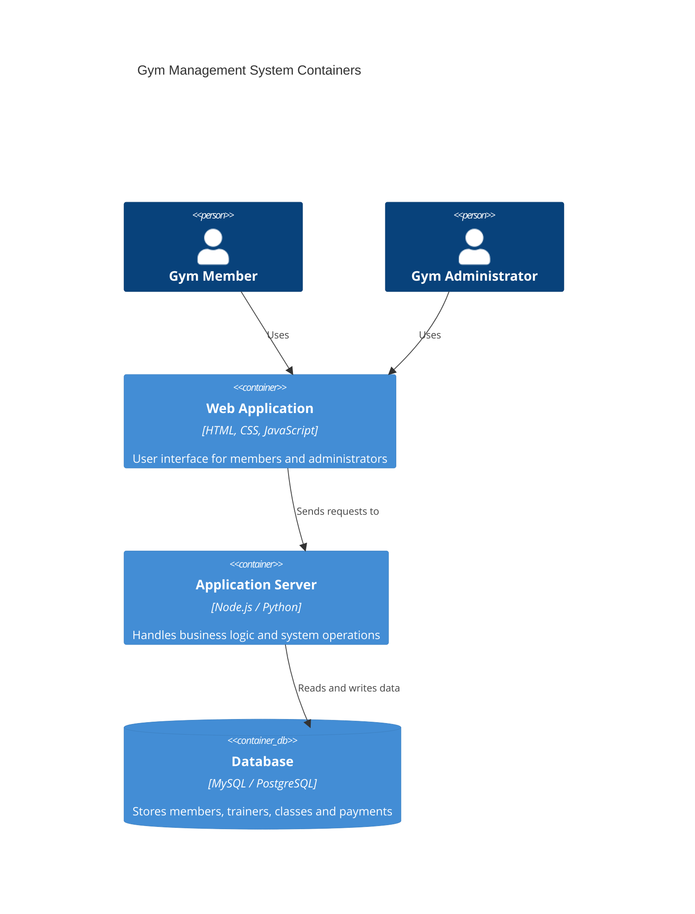

# System Architecture

## Project Title

City Fitness Club Gym Management System

## Domain

Health and Fitness Management Systems

## Problem Statement

City Fitness Club requires a centralized system to manage members, trainers, classes, and payments across multiple gym locations. A well-designed architecture ensures that the system can efficiently process user requests, manage data securely, and support future expansion.

## Individual Scope

This project focuses on designing a scalable architecture for the Gym Management System. The architecture will include a web interface for users, an application backend to process requests, and a database system to store gym data.

## System Context Diagram (C4 Level 1)

## Container Diagram (C4 Level 2)

## End-to-End Components

The system architecture includes the following key components:

1. User Interface (Web Application)
   Provides an interface where members and administrators can interact with the system.

2. Application Server
   Handles business logic such as member registration, class scheduling, trainer assignments, and payment processing.

3. Database System
   Stores all operational data including members, trainers, classes, bookings, and payment records.

4. Authentication and Security
   Ensures that only authorized users such as administrators and members can access specific system functionalities.

This layered architecture ensures that the system is scalable, maintainable, and capable of supporting multiple gym locations.
